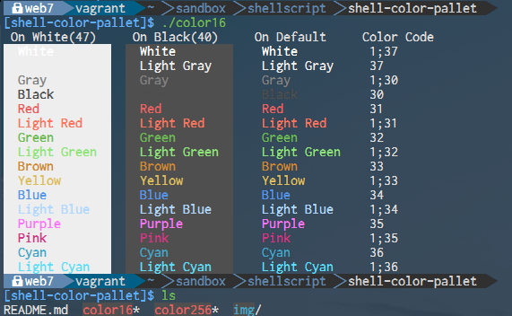

# reveal.js
## sample
### とりあえずサンプル

--

# 縦の移動
## foooooooo!!!!!

---

# 日本語
## ＼(^o^)／

---
- javascript

```.javascript
var a = 'hoge';

function hoge(a){
  console.log(a)
}

hoge(a);
```

- diff

```
+ aaa
- bbb
```

---
- shellscript

```.shellscript
#/bin/sh

echo_bar(){
  [ "$1" -gt 0 ] && printf '*%.0s' `seq "$1"`
}

while true
do
  hour=`date +%H`
  min=`date +%M`
  sec=`date +%S`

  tput cup 0 0
  tput clear
  printf "h: $hour: `echo_bar $hour`\n"
  printf "m: $min: `echo_bar $min`\n"
  printf "s: $sec: `echo_bar $sec`\n"
  sleep 1
done
```

---

# fragments
- item1 <!-- .element: class="fragment" data-fragment-index="1" -->
- item2 <!-- .element: class="fragment" data-fragment-index="2" -->
- item3 <!-- .element: class="fragment" data-fragment-index="3" -->

---

# style(動き)
- pdf変換も出来るよ <!-- .element: class="fragment grow" -->
- remarkにも付いて欲しいよ <!-- .element: class="fragment shrink" -->
- あんなに苦労したのに... <!-- .element: class="fragment current-visible" -->
- とりあえずrevealに移行しよう <!-- .element: class="fragment fade-out" -->
- mkdocsでも見れるようにする予定 <!-- .element: class="fragment highlight-current-blue" -->
- テンプレ化 <!-- .element: class="fragment highlight-red" -->
- からのLT系の資料作成時間削減 <!-- .element: class="fragment highlight-current-green" -->

---

# style(配置)

- 配置の設定(left) <!-- .element: style="text-align: left;" -->
- 配置の設定(bottom) <!-- .element: style="vertical-align: bottom;" -->

---
# テーブル

| a | b | c |
|:-|:-|:-|
| hoge | fuga | piyo |
| HOGE | FUGA | PIYO |

Note: ノートのテスト

---
# リンク
- [mkdocsのサンプル](http://swfz.github.io/mkdocs_sample )

---
# 画像
 <!-- .element: style="margin: auto;" -->

- センター寄せはなぜかこれ

```
 <!-- .element: style="margin: auto;" -->
```

---
# 画像2



---
# パララックス背景
[qiita](http://qiita.com/hilohiro/items/eab479f6dcf4a100e31b)

---

** 終わり **


